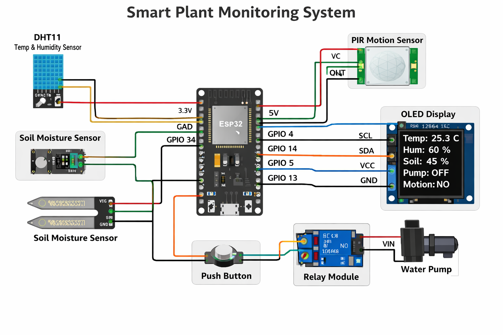
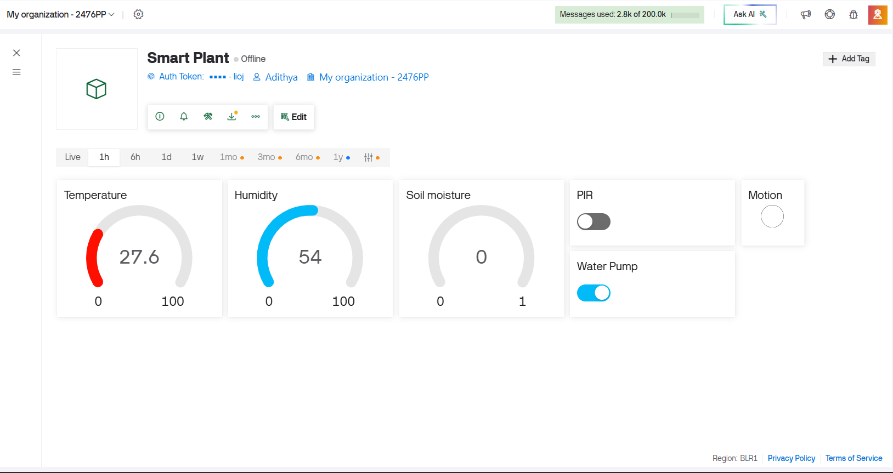
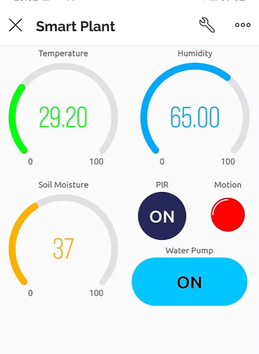

# 🌱 Smart Plant Monitoring System (ESP32 + IoT)
A Smart Plant Monitoring System built using an ESP32 microcontroller that monitors environmental conditions around a plant and allows remote monitoring and control through the Blynk IoT platform. The system measures temperature, humidity, soil moisture, and motion detection, and displays the data on an OLED screen while also sending it to a mobile dashboard.

This project demonstrates a complete IoT-based plant monitoring and control system, integrating sensors, cloud connectivity, and a user interface.

# 📌 Features
* 🌡 Temperature & Humidity Monitoring using DHT11 sensor 
* 🌱 Soil Moisture Detection to check plant water needs 
* 📟 OLED Display Interface for real-time data visualization 
* 📱 Blynk IoT Dashboard for remote monitoring and control 
* 🚰 Relay Controlled Water Pump for plant watering 
* 🔘 Manual Button Control for pump activation 
* 👀 PIR Motion Detection for motion alerts 
* ☁️ Cloud Connectivity via WiFi and Blynk 

# 🧰 Hardware Components
- ESP32 Development Board 
- DHT11 Temperature & Humidity Sensor 
- Soil Moisture Sensor 
- PIR Motion Sensor 
- Relay Module 
- OLED Display (128x64 I2C) 
- Push Button 
- Water Pump / Motor 
- Jumper Wires & Breadboard 

⚙️ How It Works
1. Sensors collect environmental data around the plant. 
2. ESP32 processes the sensor readings. 
3. Data is displayed on the OLED screen. 
4. Sensor values are sent to the Blynk IoT dashboard. 
5. Users can monitor the plant remotely via smartphone. 
6. The relay can activate a water pump for irrigation. 

# 📷 Project Demonstration

## Circuit Diagram

## Blynk Dashboard

## Mobile UI

  

